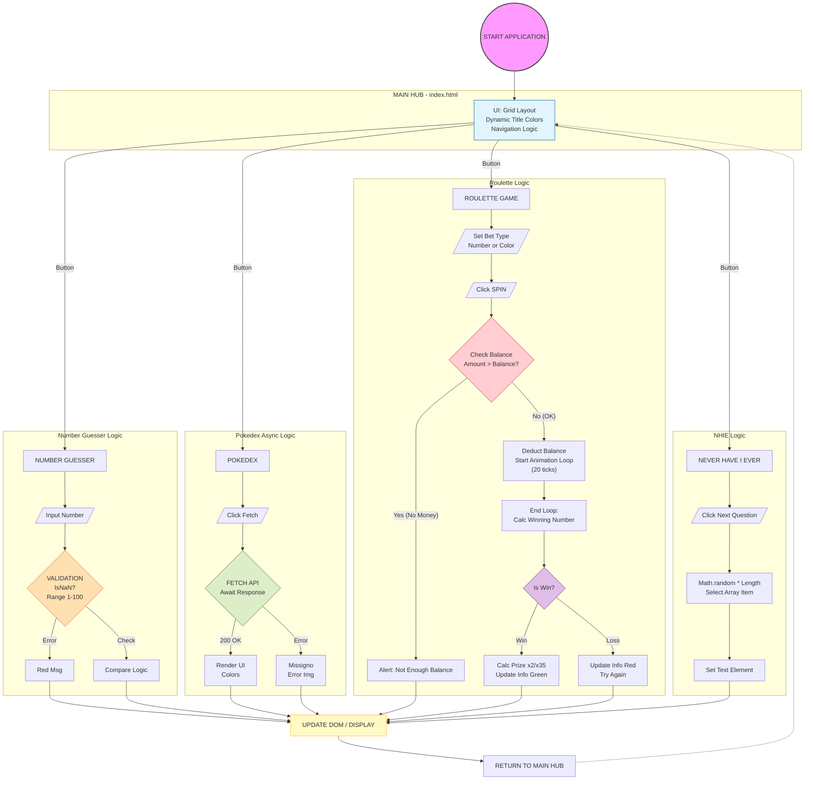

```mermaid
graph TD
    %% Entry Point
    Start((START APPLICATION)) --> MainHub

    %% Main Hub Container
    subgraph Main [MAIN HUB - index.html]
        MainHub[UI: Grid Layout <br/> Dynamic Title Colors <br/> Navigation Logic]
    end

    %% Navigation Branches
    MainHub -- Button --> NG_Start[NUMBER GUESSER]
    MainHub -- Button --> Poke_Start[POKEDEX]
    MainHub -- Button --> Roul_Start[ROULETTE GAME]
    MainHub -- Button --> NHIE_Start[NEVER HAVE I EVER]

    %% ---------------------------------------------------------
    %% GAME 1: NUMBER GUESSER
    %% ---------------------------------------------------------
    subgraph NG_Flow [Number Guesser Logic]
        NG_Start --> NG_Input[/Input Number/]
        NG_Input --> NG_Valid{VALIDATION<br/>IsNaN?<br/>Range 1-100}
        NG_Valid -- Error --> NG_Red[Red Msg]
        NG_Valid -- Check --> NG_Logic[Compare Logic]
    end

    %% ---------------------------------------------------------
    %% GAME 2: POKEDEX
    %% ---------------------------------------------------------
    subgraph Poke_Flow [Pokedex Async Logic]
        Poke_Start --> Poke_Click[/Click Fetch/]
        Poke_Click --> Poke_Fetch{FETCH API<br/>Await Response}
        Poke_Fetch -- 200 OK --> Poke_Render[Render UI<br/>Colors]
        Poke_Fetch -- Error --> Poke_Miss[Missigno<br/>Error Img]
    end

    %% ---------------------------------------------------------
    %% GAME 3: ROULETTE
    %% ---------------------------------------------------------
    subgraph Roul_Flow [Roulette Logic]
        Roul_Start --> Roul_Set[/"Set Bet Type<br/>Number or Color"/]
        Roul_Set --> Roul_Spin[/Click SPIN/]
        Roul_Spin --> Roul_BalCheck{Check Balance<br/>Amount > Balance?}
        
        Roul_BalCheck -- "Yes (No Money)" --> Roul_Err[Alert: Not Enough Balance]
        Roul_BalCheck -- "No (OK)" --> Roul_Anim["Deduct Balance<br/>Start Animation Loop<br/>(20 ticks)"]
        
        Roul_Anim --> Roul_Calc[End Loop:<br/>Calc Winning Number]
        Roul_Calc --> Roul_WinCheck{Is Win?}
        
        Roul_WinCheck -- Win --> Roul_Win[Calc Prize x2/x35<br/>Update Info Green]
        Roul_WinCheck -- Loss --> Roul_Loss[Update Info Red<br/>Try Again]
    end

    %% ---------------------------------------------------------
    %% GAME 4: NEVER HAVE I EVER
    %% ---------------------------------------------------------
    subgraph NHIE_Flow [NHIE Logic]
        NHIE_Start --> NHIE_Click[/Click Next Question/]
        NHIE_Click --> NHIE_Rand[Math.random * Length<br/>Select Array Item]
        NHIE_Rand --> NHIE_Disp[Set Text Element]
    end

    %% ---------------------------------------------------------
    %% DOM UPDATE & RETURN LOOP
    %% ---------------------------------------------------------
    %% Bağlantılar
    NG_Red & NG_Logic --> UpdateDOM
    Poke_Render & Poke_Miss --> UpdateDOM
    
    %% Roulette Bağlantıları
    Roul_Err --> UpdateDOM
    Roul_Win --> UpdateDOM
    Roul_Loss --> UpdateDOM
    
    %% NHIE Bağlantıları
    NHIE_Disp --> UpdateDOM

    UpdateDOM[UPDATE DOM / DISPLAY] --> Return[RETURN TO MAIN HUB]
    Return -.-> MainHub

    %% ---------------------------------------------------------
    %% STYLING
    %% ---------------------------------------------------------
    style Start fill:#f9f,stroke:#333,stroke-width:2px
    style MainHub fill:#e1f5fe,stroke:#01579b
    style UpdateDOM fill:#fff9c4,stroke:#fbc02d
    
    %% Logic Colors
    style NG_Valid fill:#ffe0b2,stroke:#e65100
    style Poke_Fetch fill:#dcedc8,stroke:#33691e
    style Roul_BalCheck fill:#ffcdd2,stroke:#b71c1c
    style Roul_WinCheck fill:#e1bee7,stroke:#4a148c
```